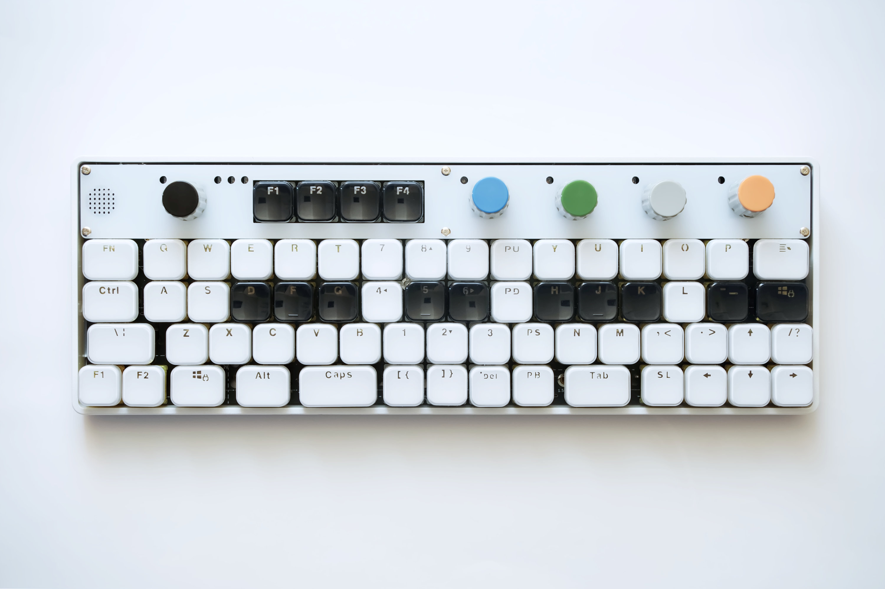

# Unison / ユニゾン とは

ユニゾン（Unison）は、GH60互換の60%ケースに収まる狭ピッチキーボードです。  
レイアウトは2種類あり、MIDIキーボードとしてDAW連携を想定した”OP-1スタイル”と、コンピュータ用のキーボードとしての使用を想定した”5rowsスタイル”があります。

[Jones](https://github.com/jpskenn/Jones)と同様に、2行目と3行目のずれをなくし、ロースタッガードとオルソリニアを組み合わせたキー配列とし、白鍵と黒鍵を表現しています。

OP-1スタイルでは、5個のロータリーエンコーダにより、ボリュームやMIDIコントロール、DAW制御をおこなうことができます。（たぶん）  

名前の由来は、MIDI用とコンピュータ用のふたつのキーボードがひとつになるイメージで、音楽用語のユニゾンとしました。

## コンセプト

このキーボードのコンセプトや実現したい要件は次の通りです。

- シンセサイザー OP-1って格好良いよね
- 狭ピッチなキーボードを使ってみたい
- ケースを作るのは大変だから、GH60型のケース対応にして、ケース設計をメイン作業に含めない。
- キーキャップの選択肢を広げる  
    安くて、そこそこ流通しているものが使えることが大前提。
- 標準的なキーキャプですべて埋められるレイアウト。
- 多キー、多ロータリーエンコーダ

## 特徴

QMKシーケンサとMIDI機能を使用するデモンストレーション  
<iframe width="560" height="315" src="https://www.youtube.com/embed/_A8NaXlWKeE" frameborder="0" allow="accelerometer; autoplay; clipboard-write; encrypted-media; gyroscope; picture-in-picture" allowfullscreen></iframe>

[QMK Sequencer & MIDI keyboard](https://youtu.be/_A8NaXlWKeE)