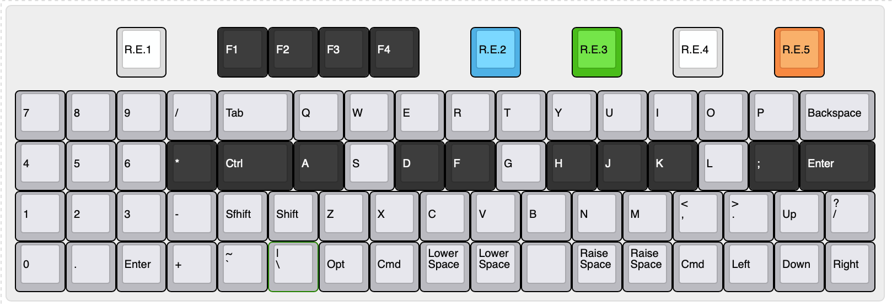

# Unison / ユニゾン とは

ユニゾン（Unison）は、GH60互換の60%ケースに収まる狭ピッチキーボードです。  

ロータリーエンコーダを搭載しシーケンサーやMIDIキーボードとしてDAW連携を想定した”Misicスタイル（ミュージック・スタイル）”と、コンピュータでの作業を想定した”Terminalスタイル（ターミナル・スタイル）”を用意しています。

音楽用とコンピュータ用のふたつのキーボードがひとつになるイメージから、音楽用語のユニゾンが名前の由来です。

## コンセプト

このキーボードのコンセプトや実現したい要件は次の通りです。

- 格好良いシンセサイザー、[OP-1](https://teenage.engineering/products/op-1)へのオマージュ。
- 狭ピッチなキーボードを作ってみたい。
- 狭ピッチなキーボードを使ってみたい。
- 挟ピッチなキーボードに触れる機会を増やしたい。
- ケースのあるキーボードを作りたいが、ケースの設計が大変だから、GH60型のケース対応にしてケース設計をメイン作業に含めない。
- キーキャップの選択肢を広げる。  
    安くて、そこそこ流通しているものが使えると普及しやすい。  
    標準的なキーキャプですべて埋められるレイアウトにしておく。
- 多キー、多ロータリーエンコーダ。

## 特徴
　
### 挟ピッチ

<!-- TODO　60%との比較写真  -->
<!-- TODO スイッチだけの写真 -->
通常の19.05mmのキーピッチに対して約87%となる、**縦16.4mm × 横16.8mm**のキーピッチを採用しています。

デザインの元となったOP-1と同様に、4行×17列のキーとロータリーエンコーダが60%キーボードのケースに収まるように配置しました。  
また、キーピッチに少し余裕を持たせることで、入手性の良い”[Cherry MX Backlit Low Profile Keycap Set](https://yushakobo.jp/shop/cherry-mx-backlit-low-profile-keycap-set/)”が使用できるようにしています。

16mmピッチ＋α以下の挟ピッチ対応キーキャップが使用できます。  
挟ピッチ対応のキーキャップについては、e3w2q氏の記事”[狹ピッチ対応キーキャップを求めて](https://e3w2q.github.io/10/)”が大変参考になります。

<!-- TODO　ロープロキャップ写真 -->
<!-- TODO YKNキャップ写真 -->

### 独自の物理配列

以前設計した60%キーボードの[Jones](https://github.com/jpskenn/Jones)と同じく、2行目と3行目のずれをなくし、ロースタッガードとオルソリニアを組み合わせたキー配列を採用しています。  

アルファ部が左右対称になることで、肘、手首、指先が直線上に並んだ自然なポジションで打鍵できるなどのメリットがあります。  
詳しくは[Jones：キーレイアウト](https://github.com/jpskenn/Jones#キーレイアウト)を参照してください。

また、この配列を採用したことで、白鍵と黒鍵のずれをうまく表現できました。

### ふたつのレイアウト・スタイル

シーケンサーやMIDIキーボードとしてDAW連携を想定した”Misicスタイル”と、コンピュータでの作業を想定した”Terminalスタイル”の2種類が選べます。

#### Musicスタイル（ミュージック・スタイル）
<!-- TODO写真 -->

DAW連携を想定したMisicスタイルは、上部に5個のロータリーエンコーダと4個のスイッチを配置した、4行×17列のレイアウトです。

[Keyboard Layout Editor: Unison Music style](http://www.keyboard-layout-editor.com/#/gists/866c93c6eb4c580be0cf582207fa1836)

キーボードファームウェア[QMK](https://github.com/qmk/qmk_firmware)の機能によってシーケンサーとMIDIキーボードが使用でき、USB接続のMIDIデバイスとしてDAWと連携させることができます。  
もちろん、通常のコンピュータ用キーボードとしても使用できます。

シーケンサーは8トラック、32ステップあり、MIDIチャンネル1に固定されています。  
音源側（DAWなど）でチャンネル1にドラムセットを割り当てて使用するのが基本です。

MIDIキーボードは24鍵の鍵盤で演奏でき、ロータリーエンコーダを使ってベロシティやトランスポーズのコントロールやオクターブの上げ下げなどがおこなえます。

シーケンサーとMIDIキーボードは、それぞれ単独でも、両方を同時にでも使用できます。  
MIDIキーボードのチャンネルを変更することで、チャンネル1でシーケンサーを再生しながら、別チャンネルに割り当てた音源が演奏できます。

参考：シーケンサーとMIDIキーボードを同時に使用するデモンストレーション動画  
  
[QMK Sequencer & MIDI keyboard](http://www.youtube.com/watch?v=_A8NaXlWKeE)

#### Terminalスタイル（ターミナル・スタイル）
<!-- TODO写真 -->
コンピュータでの作業を想定したTerminalスタイルは、数字行を含めた5行×17列のレイアウトです。

[Keyboard Layout Editor: Unison Terminal style ](http://www.keyboard-layout-editor.com/#/gists/f8cf33730eca47e1e9039568cd3ca72c)

60%キーボードにテンキーを組み合わせたようなレイアウトで、挟ピッチによって手をホームポジションから大きく動かさずに入力することができ、コンピュータでの作業を快適におこなえます。  

最下行に配置した1.5uと2uのModキーの配置は、好みに応じていくつかのバリエーションから選択でき、全て1uにすることもできます。

テンキーは、肩を開いたホームポジションとなる中央への配置がおすすめですが、左や右に配置することもできます。  

また、スピーカーを搭載することで、特定のキー操作でメロディーを鳴らしたり、ピコピコという電子音とともにキー入力することもできます。  
音楽モードをONにすれば、キーボードを鍵盤に見立てて演奏することもでき、2音同時再生によりちょっとしたハーモニーも楽しめます。
