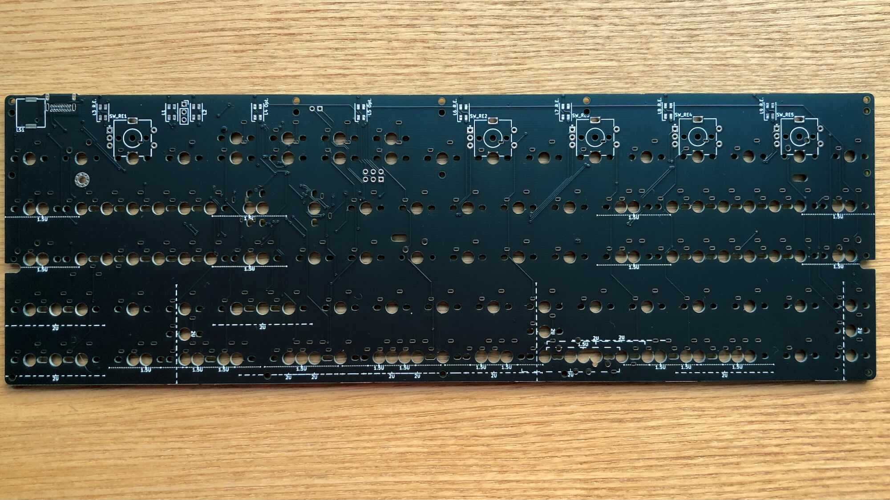
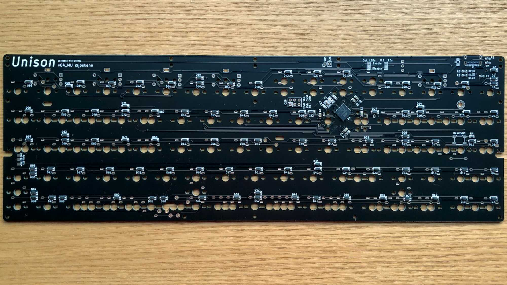
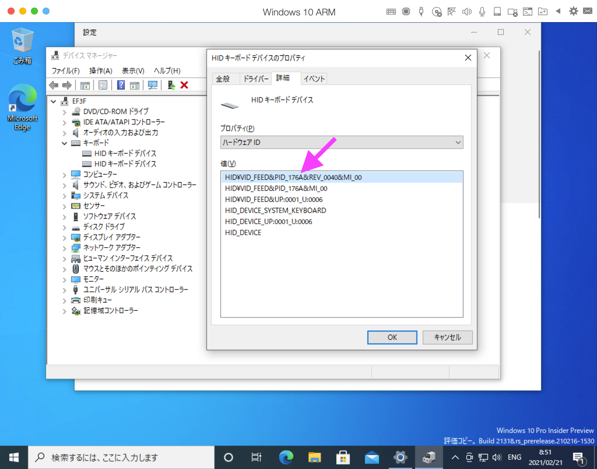

# Unison v04 ビルドガイド

購入していただいた方、リポジトリから製造していただいた方、その他の皆様、Unisonに興味を持っていただきありがとうございます。

Unisonのコンセプトや特徴などについては、[Unison README](https://github.com/jpskenn/Unison/blob/main/README.md)をご覧ください。

## 注意事項、制限など


- 5pinスイッチの取り付け穴が、少し緩めです。（v04のみ）

    設計上の不備により、5pinスイッチをがっちりと取り付けできないため、スイッチが傾かないように注意して取り付けてください。

- 基板の中央下側は、ケースにネジ止めせずに組み立てます

    スイッチをしっかりと取り付けることを優先しています。  
    この箇所をケースへネジ止めしない場合でも、特に不具合は見受けられません。  
    
- 中央下側のネジ穴にかぶさるスイッチは、スイッチの足を加工して取り付けます。  

    該当箇所では、スイッチ取り付けの安定感が低下したり、打鍵感が悪くなることがあります。

- ネジ穴にかぶさるスイッチは、基板をケースへねじ止めした後、ソケットを介して取り付けます。

    はんだ付けしないため、スイッチが少しぐらつくことがあります。  
    また、**v04ではMill-Maxソケットを使用するため、はんだ付けの難易度が多少高めです。**

- スイッチを上下逆向きや横向きに取り付ける箇所があります。  

    キーキャップによっては、キャップの内部構造とスイッチが当たるかもしれません。

- もしかしたら、取り付けできないケースがあるかもしれません。  

    全てのGH60型ケースに取り付けできるかは、なんとも言えません…  

    現在のところ、取り付け確認済みのケースは次の通りです。  
    - [KBDfans TOFU 60% ALUMINUM CASE](https://kbdfans.com/products/kbdfans-tofu-60-aluminum-case)  
    - [KBDfans 5° FROSTED ACRYLIC CNC 60% CASE](https://kbdfans.com/products/pre-order-kbdfans5-transparent-acrylic-cnc-60-case)  
    - [60% プラスチックケース](https://yushakobo.jp/shop/60-plastic-case/)（簡単な加工が必要）

    上記以外のケースへの取り付けの成功／失敗の報告を募集しております。

- MIDI機能とスピーカーを使用するAudio機能は、同時に有効化できません。

    ファームウェアサイズが大きくなりすぎ、書き込むことができません。


## 部品リスト

このキットを組み立てるためには、”キット内容物”に加え、”別途用意が必要な部品”が必要です。  

なお、”オプション部品”は使いたい機能などに合わせて任意に用意してください。  

### キット内容物

| 部品名 | 個数 |
| ----- | -----: |
| Unison 基板 v04（部品実装済み） | 1 |
| Musicスタイル用ミドルレート v04（FR-4） | 1 |
| Musicスタイル用トップレート（アクリル） | 1 |
| Terminalスタイル用トップレート（アクリル） | 1 |
| スペーサー 8mm | 6(\*)  |
| ネジ M2 5mm | 6(\*)  |
| ネジ 低頭 M2 6mm | 6(\*)  |
| ネジ 低頭 M2 5mm | 4 |
| Mill-Maxソケット 金色 | 10 |
| Mill-Maxソケット 銀色<br/>（金色取り付け失敗時用の予備）| 4 |

\*レイアウト・スタイルによって使用数が変わります。  

### 別途用意が必要な部品

| 部品名 | 個数 |
| ----- | -----: |
| MXスイッチ | Musicスタイル：70</br>Terminalスタイル：最大 83 (\*) |
| キーキャップ<br/>挟ピッチ対応のもの | 同上 |
| ケース<br/>GH60型 | 1 |
| USBケーブル <br/>Type-C | 1 |
\*レイアウトによって使用数が変わります。  

Musicスタイルでは以下の部品も必要です。
| 部品名 | 個数 |
| ----- | -----: |
| ロータリーエンコーダ<br/>EC11, EC12, またはその互換品<br/>取り付け時、基板表面から軸の先端まで20〜25mm程度のもの。<br/>ALPS EC11E18244AU, BOURNS PEC11R-4x15の使用実績あり。 | 5 |
| ロータリーエンコーダ用ノブ・つまみ | 5 |


### オプション部品

| 部品名 | 個数 |
| ----- | -----: |
| LED<br>SK6812MINI | 最大 9 |
| LEDテープ<br>アンダーグロー用 26cm程度 | 1 |
| スピーカー<br>Murata PKMCS0909E4000-R1 | 1 |


## 組み立てに必要な工具
ドライバー、ピンセット、はんだ付け関連用品など、一般的な電子工作向け工具を使用します。  
[遊舎工房の工具セット](https://yushakobo.jp/shop/a9900to/)を参考に用意してください。

なお、なくても組み立てはできますが、LEDの取り付け確認や、何か不具合があった場合の原因究明のために、テスターがあると便利です。


## 基板概要

- 基板おもて側  
部品が何も取り付けられていない方が、おもて側です。


- 基板裏側  
細かな部品がたくさん取り付けられている方が、裏側です。  
※F1, J1, D102, ResetSW1に部品を取り付ける前の写真です。


- プレート類  

    Terminalスタイル用トッププレートおもて側（保護用紙を剥がした状態）  
    Musicスタイル用トッププレート（保護用紙を剥がした状態）  
    Musicスタイル用ミドルプレートおもて側  
    

## 組み立て手順

*作業をおこなう前に、各手順に目を通しておくと作業ミスの防止につながります。*


### 組み立て前の確認

組み立てを始める前に、基板に破損がないか、表面実装部品が外れていないか（梱包の中に小さな部品が落ちていないか）を確認してください。

続いて、PCやMacに接続して、キーボードとして認識されるかを確認します。  
動作確認用のファームウェアを書き込み済みのため、部品実装済み基板に問題がなければ、キーボードとして認識されます。  
USBケーブルで接続し、下記のMacとWindowsでの確認方法や、スイッチの取り付け箇所の端子部分をピンセットなどでショートして文字を入力するなどして確認してください。

認識されなかった場合は輸送中の事故等が考えられますので、BOOTHの購入履歴から該当の注文詳細画面表示し、`ショップにメッセージを送る`で報告してください。

#### Mac, macOS Big Sur 11.2.1

キーボードをUSB接続します。

メニューバーから、``　→　`このMacについて`　→　`システムレポート…` を開きます。

左側の`ハードウェア`で`USB`を選択します。

右側のどこかに`Unison`というデバイスが表示されていれば、接続確認はOKです。

  
システムレポートの表示

#### Windows, 10 ARM64 Insider Preview - Build 21286

*Windowsをネイティブ動作させる環境がないため、Mac上の仮想環境にインストールした”Windows 10 Client ARM64 Insider Preview - Build 21286”で確認した内容です。  
実際のWindows環境と異なる点がある場合は、ご連絡いただけると助かります。*

キーボードをUSB接続します。

デバイスマネージャの`キーボード`に表示されているものを開き、`詳細`の`ハードウェアID`を表示します。

```
PID_176A
```
という文字が含まれていれば、接続確認はOKです。


  
デバイスマネージャの表示

### ファームウェアの書き込み

ファームウェアは以下よりダウンロードし、QMK Toolbox、またはQMKのコマンドなどで書き込んでください。  
各ファイルは本家QMKには取り込まれていませんので、私がフォークしたリポジトリから取得してください。

なお、動作確認用ファームウェアは、Terminalスタイル用（テンキー中央）のファームウェアを兼ねていますので、この手順での書き込みは不要です。

- QMK Toolbox用hexファイル：  
〓リンク変更
[Musicスタイル用](https://gist.github.com/jpskenn/e458aba60c828ac9f2b4f6b7c2098455)  
[Terminalスタイル用（テンキー中央）](https://gist.github.com/jpskenn/6c6ec73f580b8839b76e3e6510bacca9)  
[Terminalスタイル用（テンキー左）](https://gist.github.com/jpskenn/6c6ec73f580b8839b76e3e6510bacca9)  
[Terminalスタイル用（テンキー右）](https://gist.github.com/jpskenn/6c6ec73f580b8839b76e3e6510bacca9)  

- QMKコマンド用キーボード関連ファイル：  
[jpskenn/qmk_firmware: develop_Unisonブランチ](https://github.com/jpskenn/qmk_firmware/tree/develop_Unison/)

#### QMK Toolbox

[QMK Toolbox](https://docs.qmk.fm/#/ja/newbs_getting_started?id=qmk-toolbox)をダンロードし、使用できる状態にしておきます。  

`Open`ボタンを押して、書き込むhexファイルを指定します。  

キーボードを接続します。

キーボードのリセットスイッチを押して、`*** DFU device connected`が表示されることを確認します。  

`Flash`ボタンを押して書き込みます。

以下のような書き込みメッセージが表示されれば完了です。

  
書き込みメッセージ  
（ファイル名や%の数値などは実際と異なる場合があります）

#### QMKコマンド
ダウンロードしたファイルをQMKの`keyboards`ディレクトリ配下へ配置します。  

キーレイアウトに合わせて、いずれかのコマンドを実行します。

Musicスタイル

    qmk flash -kb unison/v04 -km music

Terminalスタイル

    qmk flash -kb unison/v04 -km terminal

何やら画面に表示された後、しばらくすると次のようなメッセージが繰り返し表示されます。

    dfu-programmer: no device present.
    ERROR: Bootloader not found. Trying again in 5s.

キーボードのリセットスイッチを押すと書き込みが始まります。

次のようなメッセージが表示されたら完了です。  
（%の数値などは実際とは異なる場合があります）

```
Bootloader Version: 0x00 (0)
Erasing flash...  Success
Checking memory from 0x0 to 0x6FFF...  Empty.
0%                            100%  Programming 0x6900 bytes...
[>>>>>>>>>>>>>>>>>>>>>>>>>>>>>>>>]  Success
0%                            100%  Reading 0x7000 bytes...
[>>>>>>>>>>>>>>>>>>>>>>>>>>>>>>>>]  Success
Validating...  Success
0x6900 bytes written into 0x7000 bytes memory (93.75%).
```

### （オプション）LEDの取り付け
基板裏側でジャンパし、おもて側へLEDを取り付けます。

#### LEDの取り付け箇所
LEDの取り付け箇所は、次の3グループに分かれています。

- インジケータ 2個：`L1`,  `L2`
- ロータリーエンコーダの隣（以降、REサイドと呼称） 5個：`L3 R.E.`, `L6 R.E.`, `L7 R.E.`, `L8 R.E.`, `L9 R.E.`
- 追加オプション 2個：`L4 Opt.`, `L5 Opt.`


#### LEDグループの有効な組み合わせ
LEDグループの有効な組み合わせは、以下の表のとおりです。

| 組み合わせ | インジケータ | REサイド | 追加オプション |
| :--: | :--: | :--: | :--: |
| A | あり | なし | なし |
| B | あり | あり | なし |
| C | あり | あり | あり |

表に載っていない「REサイド：なし、追加オプション：あり」などは無効な組み合わせです。

#### ファームウェアに定義されたLEDグループの組み合わせ
ファームウェアに定義されたLEDグループの組み合わせは、次のとおりです。  
これ以外の組み合わせにする場合は、ファームウェアの定義を変更してください。

- Musicスタイル  
    組み合わせB：インジケータ  ＋ REサイド

- Terminalスタイル  
    組み合わせC：インジケータ ＋ REサイド ＋ 追加オプション

なお、インジケータLEDの2個だけを取り付け、点灯させることができます。
この場合はファームウェアの変更は不要です。

##### LEDの取り付け

LEDをどの組み合わせで取り付けるか確認します。

REサイドのLEDを使用する場合は、基板裏側のジャンパ`R.E. LEDs`を`Enable`に、使用しない場合は`Disable`にジャンパします。

追加オプションのLEDを使用する場合は、基板裏側のジャンパ`Opt. LEDs`を`Enable`に、使用しない場合は`Disable`にジャンパします。

  
LEDジャンパ位置

  
`R.E. LEDs`を`Enable`に、`Opt. LEDs`を`Disable`にジャンパした例


基板おもて側から、選んだ組み合わせのLED取り付け位置を確認します。  


取り付け位置のLEDのパッドのうち、1箇所だけに予備はんだしておきます。

LED発光面の切り欠きマーク（▲）が、設置位置を示す線に合うように、LEDを基板に置きます。  


LED取り付け方向


LEDは高温ではんだ付けすると壊れるため、コテ先温度を220-270℃に設定します。  
使用するはんだの種類や作業手順にもよりますが、220℃では加熱不足によるはんだ不良に注意してください。  
[加熱不足による、はんだ不良の例](https://twitter.com/jpskenn/status/1291328876283478016)

フラックスを塗っておくとはんだ付けしやすくなります。

予備はんだした箇所をはんだ付けします。  
ピンセットでLEDをつまみ、位置がずれないようにします。  
小手先温度を220-270℃にして、LEDの横方向からパッドとLEDにコテ先をあて、1、2と数えてコテ先を離します。  
さらに1、2と数えてLEDを固定していたピンセットを離します。  
はんだが小さな球のようになっていれば良い仕上がりです。

LEDの位置がずれていないことを確認します。

残りの3箇所をはんだ付けします。  
予備はんだ以外の3箇所は、少量のはんだをコテ先に乗せておき、先ほどと同様の手順をおこないます。


取り付けたLED


### （オプション）スピーカーの取り付け
基板おもて側にスピーカーを取り付けます。

取り付け場所が狭く、スペーサーと干渉しやすいため、USBコネクタ側に寄せるようにして取り付けます。  
スペーサーを仮に取り付け、干渉しない位置を確認しておくと安心です。

基板おもて側、スピーカー`LS1`のパッド2箇所のうち、1箇所だけに予備はんだしておきます。

スピーカーの端子部をパッドに合わせて置きます。  
どちらの方向に取り付けても大丈夫です。  

予備はんだした箇所をはんだ付けします

スピーカーがまっすぐ取り付けられていることを確認します。

残りの1箇所をはんだ付けします。


取り付けたスピーカー


### スイッチソケットの取り付け
基板裏側から取り付けます。

`左上`, `左下`, `右上`, `右下`, `中央`の5箇所のネジ穴にかぶさるスイッチに、ソケットを取り付けます。  
v04ではMill-Maxソケットを取り付けます。

スイッチを1個用意し、スイッチの端子にMill-Maxソケットを差し込みます。  
差し込む際に端子を曲げてしまいやすいので注意してください。
*細かい部品のはんだ付けに不安がある場合は、失敗した場合にそなえ、どうなっても良いスイッチを使用することをおすすめします。*


Mill-Maxソケットを差し込んだスイッチ

Mill-Maxソケットを差し込んだスイッチを、基板へはめ込みます。  
固定がゆるい場合は、マスキングテープなどを貼って仮止めしておきます。

基板を裏返し、Mill-Maxソケットをはんだ付けします。  
はんだをつけすぎて、ソケット先端からスイッチの端子へ流れ込まないように注意してください。


取り付けの様子

スイッチを取り外します。

基板おもて面から見て、ソケットが奥まで差し込まれてはんだ付けされていることを確認します。  
少し浮いているような場合は、ソケットをはんだ小手で加熱しながら、ドライバーなどで慎重に押し込みます。


取り付けたソケット

### キースイッチの取り付け
基板おもて面からスイッチを取り付けます。

取り付けを始める前に、スイッチの端子が真っ直ぐになっていることを確認しておきます。

使用するレイアウト・スタイルに合わせて、スイッチを基板にはめ込みます。
[Musicスタイル](http://www.keyboard-layout-editor.com/#/gists/866c93c6eb4c580be0cf582207fa1836)
[Terminalスタイル](http://www.keyboard-layout-editor.com/#/gists/f8cf33730eca47e1e9039568cd3ca72c)

なお、中央下側のネジ穴にかぶさるスイッチは、後述の[スイッチ足の加工](#スイッチ足の加工)をおこなってからはめ込みます。

スイッチの固定がゆるい場合は、マスキングテープなどを貼って仮止めしておきます。
一度に全てはめ込まず、5個や10個ずつ作業を進めると確実です。


はめ込んだスイッチを仮止めした様子

スイッチが外れないように注意しながら、基板を裏返します。

各スイッチの端子の**片方だけ**をはんだ付けします。

基板をおもて側にして、スイッチが傾かず、奥までしっかりとはまって取り付けられていることを確認します。  
傾きがある場合などは、スイッチの端子をはんだ小手で加熱して調整します。

基板をもう一度裏返して、残った端子をはんだ付けして固定します。

作業を繰り返し、残りのスイッチを取り付けます。


#### スイッチ足の加工

中央下側のネジ穴にかぶさるスイッチを取り付けるには、スイッチ足の加工が必要です。

スイッチの取り付け位置、スイッチの形状、使用するケースなどによって加工内容が変わるので、現物合わせで加工します。

- 5pinスイッチの片方の足が干渉する場合

    片方の足をニッパーなどで切り取ります。  
    

- 中央の足（でっぱり部分）が干渉する場合

    中央の足（でっぱり部分）がケースのネジ穴に当たらない程度にカットします。
    場合によっては全てカットすることもあります。

    押下時に軸がネジに当たる場合は、軸の下端もカットします。  

      
    縦に切れ込みを入れる様子

      
    切れ込みを入れたところまでカットする様子

    足をカットしたスイッチ  
      

    左から順に  
    - Gateron Silent Red 5pin：片方の足をカット
    - Gateron Ink Black 5pin：片方の足をカット
    - Kailh Pro Burgundy 3pin：無加工
    - Gateron Ink Red 5pin：片方の足をカット、中央の足を1/3カット
    - Gateron Silent Red 5pin：両方の足をカット、中央の足を全てカット


### （オプション）ロータリーエンコーダの取り付け
基板おもて面から取り付けます。

取り付け位置は、`SW_RE1`から`SW_RE5`の5箇所です。

ピンと足の位置を合わせて基板に差し込みます。  
足が差し込みにくいときは、横から少し押さえて差し込みます。

基板裏側から、何本かあるピンのうち1本だけをはんだ付けします。

ロータリーエンコーダがまっすぐ取り付けられていることを確認します。

残りのピンをはんだ付けします。


取り付けたロータリーエンコーダ（基板おもて側）

### （オプション）LEDテープの取り付け
基板裏側から`LED Strip`へ取り付けます。

LEDテープの取り付け位置を確認し、使用する長さにカットしておきます。  
基板上の部品などとのショートが心配される箇所は、絶縁のためにカプトンテープなどを貼っておきます。

基板のLEDテープ用パッドの、+5V、LED、GNDの3箇所に予備はんだしておきます。

LEDテープをパッドに重ね、端子部分をコテ先で押さえつけるようにして、真ん中のLEDパッドだけをはんだ付けします。

LEDテープがまっすぐ取り付けられていることを確認します。

残りの+5VとGNDのパッドをはんだ付けします。

テープを貼り付けます。  
テープ自体のシール部分を使わず、カプトンテープなどで貼り付けておくと、後からメンテナンスしやすいかもしれません。

  
LEDテープを取り付けた状態


### 動作確認
ケースへ取り付ける前に、キーボードをPCやMacに接続して動作確認を行います。

#### キースイッチの動作確認
確認の前に、OSの設定方法に従い、OSが認識するキーボードの配列を英語キーボード（ANSI）に合わせておきます。

キースイッチの動作確認は、OSのキーボードビューアや、[Keyboard Checker](https://keyboardchecker.com)、[QMK Configrator](https://config.qmk.fm/)の入力テスト機能を使用して行います。  
全てのキーで正常に入力できることを確認します。

なお、初めてUnisonキーボードを使用する際はMac向けのキーマップに設定されているため、Windows環境では`ALT`と`Win`が逆に認識されます。  
これを切り替えるには、Windows向けのキーマップへは`Lower + Raise + W`を、Mac向けのキーマップへは`Lower + Raise + Q`のキーを同時に押します。  
※`Lower`は左スペース、`Raise`は右スペースの長押し。

正常に入力できないキーがあった場合は、原因を調査し、修復します。

特定のスイッチ1個だけが入力できない場合、もっとも多い原因は、スイッチの取り付け不良です。  
はんだ不良や、片方の端子をはんだ付けし忘れていたりしていないか確認します。  

上記で解決できなかった場合、基板のスイッチ取り付け部分の端子をピンセットなどを使ってショートさせ、キー入力されるか確認します。  
キー入力された場合は、スイッチに問題があるため、再度取り付けの不良を確認します。  
それでも改善されない場合は、スイッチを別のものに交換します。

スイッチ1個だけではなく、1行や1列のスイッチが入力できない場合は、基板や実装された部品へのダメージなどが原因と考えられます。  
これまでの軽微な作業ミスが原因だった場合とは異なり、原因箇所の特定にはテスターを使った詳しい調査が必要となり、修復の難易度も高くなることが予想されます。  
[Unison v04_MU KiCadプロジェクト](https://github.com/jpskenn/Unison/releases/tag/v04_MU)のPCB設計を参照し、パッド、ダイオード、MCUのピンなどの導通を確認して調査します。  
なお、基板製造上の問題を含む場合も疑われますので、[Twitter: @jpskenn](https://twitter.com/jpskenn/)へご一報いただければ、何か情報共有できるかもしれません。

#### ロータリーエンコーダの動作確認（Musicスタイルのみ）

`Lower`と`Raise`を同時に押しながらロータリーエンコーダのつまみを回し、OSの音声出力ボリュームが変化することを確認します。  

プッシュボタンスイッチ付きのロータリーエンコーダでは、`Lower`と`Raise`を同時に押しながらプッシュすると、OSの音声出力がミュート／ミュート解除されることを確認します。

動作不良の場合は、はんだ付けをやり直してください。


#### LEDの動作確認

取り付けたLED全てが点灯していれば正常です。

インジケータの2個以外が消えている場合、`Lower + Raise + L`で点灯オン／オフを切り替え、全てのLEDが点灯すれば正常です。

光らない箇所がある場合は、次の2点を確認します。
- 光らないLEDの取り付けに問題がある
    → 光らないLEDのはんだ付けをやり直す
- 光らないLEDのひとつ前のLEDの取り付けに問題がある（前のLEDから信号が届かないため光らない）
    → ひとつ前のLEDのはんだ付けをやり直す

なお、LEDグループごとのLEDの並び順は、次のとおりです。

- 組み合わせA：インジケータ
`L1`,  `L2`, `LEDテープ`

- 組み合わせB：インジケータ  ＋ REサイド
`L1`,  `L2`, `L3 R.E.`, `L6 R.E.`, `L7 R.E.`, `L8 R.E.`, `L9 R.E.`, `LEDテープ`

- 組み合わせC：インジケータ ＋ REサイド ＋ 追加オプション
`L1`,  `L2`, `L3 R.E.`, `L4 Opt.`, `L5 Opt.`, `L6 R.E.`, `L7 R.E.`, `L8 R.E.`, `L9 R.E.`, `LEDテープ`

220-270℃で1、2と数える程の加熱ではそう簡単にはLEDは壊れないと考えますが、何度かはんだをやり直しても点灯しない場合は、LEDが壊れていると判断して新しいものに交換します。

（参考）主なLED関連キーは次の通りです。

    Lower + Raise + L  LED点灯のオン／オフ
    Lower + Raise + Lの右隣のキー（;）　次の点灯モードに切り替え
    Lower + Raise + P　前の点灯モードに切り替え
    Lower + Raise + I　LEDの輝度増加
    Lower + Raise + K　LEDの輝度低下


#### スピーカーの動作確認（Terminalモードのみ）
キーボードを接続した際、♪ピロリロという音が鳴っていれば確認OKです。

音が鳴らない場合は、スピーカーのはんだ付けをやり直します。

主なスピーカー関連キーは次の通りです。

    Lower + Raise + A　スピーカーのオン／オフ切り替え
    Lower + Raise + S　タイプ音のオン／オフ切り替え
    Lower + Raise + A　ミュージックモードのオン／オフ切り替え


### プレート用スペーサーの取り付け
基板おもて側にスペーサーを取り付け、裏側からねじ止めします。

スペーサーの取り付け位置は次のとおりです。


スタイル・レイアウトごとの取り付け位置

取り付け位置にスペーサーを配置し、基板裏側からM2 5mmのネジで止めます。  
ギュウギュウとネジを締め込むと基板が破損する場合がるため、スペーサーが軽く止まってネジが緩んでこない程度にしておきます。


スペーサーを取り付けた状態

### （該当者のみ）60% プラスチックケースの加工

60% プラスチックケースへ取り付ける際は、ネジ穴と同じ高さのケース内リブが基板上の部品と干渉するため、以下の加工を行います。

カットする箇所を確認します。  
次の場所の、ケースネジ穴と同じ高さになっているリブです。  
- 左の上側ネジの上下。
- 右の上側ネジの上下。
- 中央付近、左右に長いリブ2本。
- ケース一番下の長いリブのうち、スイッチの端子などに当たる部分。  


カット箇所

写真で示した部分を、ニッパーやカッターなどを使ってカットします。  
ニッパー使用時は、1-2mmくらいずつ切り進んでいきます。  
それ以上の長さをカットすると、意図しないところまで割れてしまうことがあります。


カット前：左の上側ネジの上下


カット後：左の上側ネジの上下


### ケースへの取り付け

取り付け前に、ネジ穴にかぶさるスイッチは外しておきます。

基板の奥側（USBコネクタ側）からケース内へ入れていきます。  
ケースに対して基板を30度くらいの角度で差し込むと、USBコネクタがケースの穴にスッとはまります。  
その状態で基板の手前側をおろして水平にすると、力をかけることなく、基板全体がストンとケースに入ります。  
力を入れてグリグリとこじったり、ググググッと押し込むようなことはせず、角度を合わせて差し込むだけです。

〓写真撮影

30度で差し込む

ケースネジ穴と基板のネジ穴の位置を合わせ、`左上`, `左下`, `右上`, `右下`, `中央`の5箇所を、M2 5mmの低頭ネジで仮止めします。  
なお、中央をネジ止めせずに使用しても特に問題ありません。

基板がケース内で上下左右の真ん中になるように位置を調整します。

ネジを固定します。  

取り外してしていたスイッチを取り付けます。

### プレートの取り付け
レイアウト・スタイルに合わせ、ミドルプレートとトッププレートを取り付けます。  

**アクリルプレートは割れたりヒビが入りやすいので丁寧に扱います**

アクリルプレートに貼ってある保護用紙を剥がします。  
少し剥がしにくいですが、端の方を爪で軽く引っ掻くようにすると剥がれます。

スペーサーにプレートを乗せ、M2 6mmの低頭ネジで固定します。  
なお、アクリルプレートが割れやすいため、軽く固定される程度にしておきます。


### 仕上げ

PCやMacに接続し、各部の動作を簡単に確認します。

ケース底面に滑り止めのクッションパッドを貼り付けます。  
60% プラスチックケースに付属するパッドが貼り付け部分よりも大きい場合は、ハサミなどでカットして貼り付けます。

（オプション）ロータリーエンコーダのノブを取り付けます。

キーキャップを取り付けます。

完成です。

写真を撮影し、`#Unison_kbd` のタグをつけてツイートすると設計者が喜んだりします。  
[Twitter: #Unison_kbd](https://twitter.com/search?q=%23Unison_kbd)
