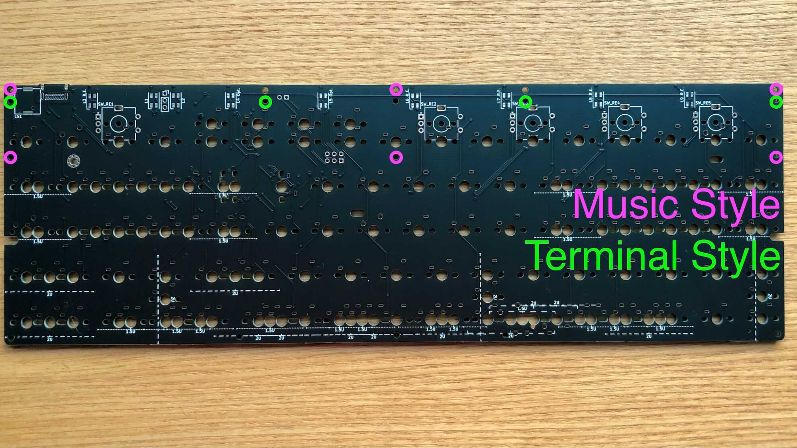

# Unison v04 ビルドガイド

購入していただいた方、リポジトリから製造していただいた方、その他の皆様、Unisonに興味を持っていただきありがとうございます。

Unisonのコンセプトや特徴などについては、[Unison README](https://github.com/jpskenn/Unison/blob/main/README.md)をご覧ください。

## 注意事項、制限など

- 5pinスイッチの取り付け穴が緩めです。（v04のみ）

    設計上の不備により、5pinスイッチをがっちりと取り付けできないため、スイッチが傾かないように注意して取り付けてください。

- 中央下側のネジは、ケースへ止めずに組み立てます。

    スイッチをしっかりと取り付けることを優先しています。  
    この箇所をケースへネジ止めしない場合でも、特に不具合は見受けられません。  

- 中央下側のネジ穴にかぶさるスイッチは、スイッチの足を加工して取り付けます。  

    該当箇所では、スイッチ取り付けの安定感が低下したり、打鍵感が悪くなることがあります。

- ネジ穴にかぶさるスイッチは、基板をケースへねじ止めした後、ソケットを介して取り付けます。

    はんだ付けしないため、スイッチが少しぐらつくことがあります。  
    また、**v04ではMill-Maxソケットを使用するため、はんだ付けの難易度が多少高め**です。

- スイッチを上下逆向きや、横向きに取り付ける箇所があります。  

    キーキャップによっては、キャップの内部構造とスイッチが当たるかもしれません。

- もしかしたら、取り付けできないケースがあるかもしれません。  

  現在のところ、下記のケースで取り付けできることを確認済みです。
  - [KBDfans TOFU 60% ALUMINUM CASE](https://kbdfans.com/products/kbdfans-tofu-60-aluminum-case)  
  - [KBDfans 5° FROSTED ACRYLIC CNC 60% CASE](https://kbdfans.com/products/pre-order-kbdfans5-transparent-acrylic-cnc-60-case)  
  - [60% プラスチックケース](https://yushakobo.jp/shop/60-plastic-case/)（簡単な加工が必要）

  上記以外のケースへの取り付けの成功／失敗の報告を募集しています。

- Musicスタイルのスピーカーホールは、デザイン上設けられたハリボテです。

    ファームウェアサイズの制限により、MIDI機能とスピーカーを使用するAudio機能は同時に有効化できません。  
    MIDI機能を使用しない場合は、Audio機能を有効化してスピーカーを使用できます。

- スピーカーを使用するAudio機能は、単音再生となります。（v04のみ）

    設計上の都合により、v04では2音同時再生に対応できませんでした。

## 部品リスト

このキットを組み立てるためには、”キット内容物”に加え、”別途用意が必要な部品”が必要です。  

なお、”オプション部品”は使いたい機能などに合わせて任意に用意してください。  

### キット内容物

| 部品名 | 個数 |
| ----- | -----: |
| Unison 基板 v04（部品実装済み） | 1 |
| Musicスタイル用ミドルレート v04（FR-4） | 1 |
| Musicスタイル用トップレート（アクリル） | 1 |
| Terminalスタイル用トップレート（アクリル） | 1 |
| スペーサー 8mm | 6(\*)  |
| ネジ M2 5mm<br>スペーサー固定用 | 6(\*)  |
| ネジ 低頭 M2 6mm<br>プレート固定用 | 6(\*)  |
| ネジ 低頭 M2 5mm<br>ケース固定用 | 5 |
| Mill-Maxソケット 金色<br> [7305-0-15-15-47-27-10-0](https://www.digikey.jp/product-detail/ja/mill-max-manufacturing-corp/7305-0-15-15-47-27-10-0/ED1039-ND/1765737)| 10 |
| Mill-Maxソケット 銀色<br>[0305-2-15-80-47-80-10-0](https://www.digikey.jp/product-detail/ja/mill-max-manufacturing-corp/0305-2-15-80-47-80-10-0/ED90584-ND/2639493)<br>（取り付け失敗時用予備）| 4 |

\* レイアウト・スタイルによって使用数が変わります。  

### 別途用意が必要な部品

| 部品名 | 個数 |
| ----- | -----: |
| MXスイッチ<br>取り付けの安定性が高い、5pinのものを推奨。 | Musicスタイル：70</br>Terminalスタイル：最大 83 (\*) |
| キーキャップ<br>挟ピッチに対応する、16mm＋α以下のもの。<br>[Cherry MX Backlit Low Profile Keycap Set](https://yushakobo.jp/shop/cherry-mx-backlit-low-profile-keycap-set/), [YKNキーキャップセット(MX/ChocV2スイッチ 16x16mmキーピッチ用) v1.2](https://make.dmm.com/item/1279617/)など | 同上 |
| ケース<br>GH60型 | 1 |
| USBケーブル <br>Type-C | 1 |

\* Modキーの配置によって使用数が変わります。  

Musicスタイルは、以下も必要となります。
| 部品名 | 個数 |
| ----- | -----: |
| ロータリーエンコーダ<br>EC11, EC12, またはその互換品<br>取り付け時、基板表面から軸の先端まで20〜25mm程度のもの。<br>[ALPS EC11E18244AU](https://tech.alpsalpine.com/prod/j/html/encoder/incremental/ec11/ec11e18244au.html), [BOURNS PEC11R-4x15](https://www.digikey.jp/htmldatasheets/production/1399781/0/0/1/pec11r-4015f-n0024.html)など | 5 |
| ロータリーエンコーダ用ノブ・つまみ | 5 |
| LED<br>SK6812MINI<br>無くても動作するが、シーケンサーの操作などがほぼ不可能となる | 7 |

### オプション部品

| 部品名 | 個数 |
| ----- | -----: |
| LED<br>SK6812MINI | 最大 9 (\*) |
| LEDテープ<br>アンダーグロー用 26cm程度 | 1 |
| スピーカー<br>[Murata PKMCS0909E4000-R1](https://www.digikey.jp/product-detail/ja/PKMCS0909E4000-R1/490-9647-1-ND/4878401/?itemSeq=353128711) | 1 |

\* LEDの設置場所によって使用数が変わります。

## 組み立てに必要な工具

ドライバー、ピンセット、はんだ付け関連用品など、一般的な電子工作向け工具を使用します。  
[遊舎工房の工具セット](https://yushakobo.jp/shop/a9900to/)を参考に用意してください。

なお、なくても組み立てはできますが、何か不具合があった場合の原因究明のために、テスターがあると便利です。

## キット内容物概要

- 基板おもて側  
部品が何も取り付けられていない方が、おもて側です。


- 基板裏側  
細かな部品がたくさん取り付けられている方が、裏側です。  


- プレート類  
    上から順に
    Terminalスタイル用トッププレートおもて側（保護用紙を剥がした状態）  
    Musicスタイル用トッププレート（保護用紙を剥がした状態）  
    Musicスタイル用ミドルプレートおもて側  
    

- 小物パーツ類
    上段左より、スペーサー 8mm, ネジ M2 5mm, ネジ 低頭 M2 5mm, ネジ 低頭 M2 6mm。  
    下段左より、Mill-Maxソケット 金色, Mill-Maxソケット 銀色,  
    （※ネジ類の色は仕入れ時期などによって変わることがあります）
    

## 組み立て手順

**作業をおこなう前に、各手順に目を通しておくと作業ミスの防止につながります。**

### 組み立て前の確認

#### 同梱物の確認

組み立てを始める前に、同梱物に不足がないか確認してください。  
また、基板に破損がないか、実装された部品が外れていないか（梱包の中に小さな部品が落ちていないか）も確認してください。

#### 接続確認

続いて、基板をPCやMacに接続して、キーボードとして認識されるかを確認します。  

動作確認用として”Terminalスタイル VIA対応ファームウェア”を書き込み済みですので、USB接続するとキーボードとして認識されます。  
下記のMacとWindowsでの確認方法や、スイッチの取り付け箇所の端子部分をピンセットなどでショートして文字を入力するなどの方法で確認してください。

動作確認用のファームウェアを書き込んだ際に全てのキーが正しく反応することを確認済みですが、このタイミングで全てのキーが正しく反応するかを確認しておくと、何かあった場合の問題切り分けがやりやすくなります。

##### Mac, macOS Big Sur 11.2.1

USB接続します。

メニューバーから、``　→　`このMacについて`　→　`システムレポート…` を開きます。

左側の`ハードウェア`で`USB`を選択します。

右側のどこかに`Unison`というデバイスが表示されていれば、接続確認はOKです。

  
システムレポートの表示

##### Windows, 10 ARM64 Insider Preview - Build 21286

*当方にWindowsをネイティブ動作させる環境がないため、Mac上の仮想環境にインストールした”Windows 10 Client ARM64 Insider Preview - Build 21286”で確認した内容です。*

USB接続します。

`設定` → `Bluetooth とその他のデバイス`を開き、  
`マウス、キーボード、ペン`の項目に`Unison`が表示されていれば、接続確認はOKです。

  
デバイスの表示

### ファームウェアの書き込み

QMK Toolbox、またはQMKのコマンドなどで書き込んでください。  

なお、動作確認用として”Terminalスタイル VIA対応ファームウェア”を書き込んでいますので、Terminalスタイルを組み立てる場合は、この手順での書き込みは不要です。  

#### QMK Toolbox

[QMK Toolbox](https://docs.qmk.fm/#/ja/newbs_getting_started?id=qmk-toolbox)をダンロードし、使用できる状態にしておきます。  

使用するレイアウト・スタイルに合わせ、QMK Toolbox用hexファイルをダウンロードします。  

- Musicスタイルファームウェア  

    [unison_v04_music.hex](https://gist.github.com/jpskenn/32210c4bdc371ec8600858d6645fd631)

- Terminalスタイル VIA対応ファームウェア  

    [unison_v04_via.hex](https://gist.github.com/jpskenn/c5ac2e3940cbc7818c12e1140436567f)  

`Open`ボタンを押して、ファイル選択ダイアログで書き込むhexファイルを指定します。  

USB接続します。

基板裏側のリセットスイッチを押して、`*** Atmel DFU device connected`が表示されることを確認します。  

`Flash`ボタンを押します。

以下のような書き込みメッセージが表示されれば完了です。

  
ファームウェアの書き込みメッセージ  
（ファイル名や%の数値などは実際と異なる場合があります）

#### QMKコマンド

”[QMK環境の構築：ビルド環境を準備する](https://docs.qmk.fm/#/ja/newbs_getting_started?id=set-up-your-environment)”を参考に、QMKのビルド環境を構築しておきます。

*現在のところ、Unison関連ファイルは本家QMKには取り込まれていませんので、私がフォークしたリポジトリから取得してください。*

[jpskenn/qmk_firmware: develop_Unisonブランチ](https://github.com/jpskenn/qmk_firmware/tree/develop_Unison/)をダウンロードします。

ダウンロードした中の`keyboards`ディレクトリ配下の`unison`ディクトリを、先ほど構築したQMKの`keyboards`ディレクトリ配下へ配置します。  

キーレイアウトに合わせて、いずれかのコマンドを実行します。

- Musicスタイル  

    ```console
    qmk flash -kb unison/v04 -km music
    ```

- Terminalスタイル（テンキー中央）

    ```console
    qmk flash -kb unison/v04 -km via
    ```

何やら画面に表示された後、しばらくすると次のようなメッセージが繰り返し表示されます。

```console
dfu-programmer: no device present.
ERROR: Bootloader not found. Trying again in 5s.
```

キーボードのリセットスイッチを押すと書き込みが始まります。

次のようなメッセージが表示されたら完了です。  
（%の数値などは実際とは異なる場合があります）

```console
Bootloader Version: 0x00 (0)
Erasing flash...  Success
Checking memory from 0x0 to 0x6FFF...  Empty.
0%                            100%  Programming 0x6900 bytes...
[>>>>>>>>>>>>>>>>>>>>>>>>>>>>>>>>]  Success
0%                            100%  Reading 0x7000 bytes...
[>>>>>>>>>>>>>>>>>>>>>>>>>>>>>>>>]  Success
Validating...  Success
0x6900 bytes written into 0x7000 bytes memory (93.75%).
```

### （オプション）LEDの取り付け

基板裏側でジャンパし、おもて側へLEDを取り付けます。

#### LEDの取り付け箇所

LEDの取り付け箇所は、次の3グループに分かれています。

- インジケータ 2個：`L1`,  `L2`
- ロータリーエンコーダの隣（以降、REサイドと呼称） 5個：`L3 R.E.`, `L6 R.E.`, `L7 R.E.`, `L8 R.E.`, `L9 R.E.`
- 追加オプション 2個：`L4 Opt.`, `L5 Opt.`


#### LEDグループの組み合わせ

LEDグループの組み合わせは、以下の表のとおりです。

| 組み合わせ | インジケータ | REサイド | 追加オプション |
| :--: | :--: | :--: | :--: |
| A | あり | なし | なし |
| B | あり | あり | なし |
| C | あり | あり | あり |

表に載っていない「REサイド：なし、追加オプション：あり」などは、無効な組み合わせです。

#### ファームウェアに定義されたLEDの設定

ファームウェアに定義されているLEDの設定は、次のとおりです。  
これ以外の組み合わせや、LEDの数が異なる場合は、ファームウェアの定義を変更してください。

- Musicスタイル  
    組み合わせB：インジケータ（2個） ＋ REサイド（5個） ＋ LEDテープ（8個）

- Terminalスタイル  
    組み合わせC：インジケータ（2個） ＋ REサイド（5個） ＋ 追加オプション（2個） ＋ LEDテープ（8個）

なお、インジケータLEDの2個だけを取り付けて、点灯させることができます。  
この場合はファームウェアの変更は不要です。

#### 取り付けるLEDに応じたジャンパ

LEDをどの組み合わせで取り付けるか確認します。

REサイドのLEDを使用する場合は、基板裏側のジャンパ`R.E. LEDs`を`Enable`に、使用しない場合は`Disable`にジャンパします。

追加オプションのLEDを使用する場合は、基板裏側のジャンパ`Opt. LEDs`を`Enable`に、使用しない場合は`Disable`にジャンパします。

  
LEDジャンパ位置

  
`R.E. LEDs`を`Enable`に、`Opt. LEDs`を`Disable`にジャンパした例

#### LEDの取り付け

基板おもて側から、選んだ組み合わせのLED取り付け位置を確認します。  

LEDの取り付け方向は、発光面の切り欠きマーク（▲）が、設置位置を示す短い横線に合う方向です。


LED取り付け方向

LEDは高温ではんだ付けすると壊れるため、コテ先温度を220-270℃に設定します。  
使用するはんだの種類や作業手順にもよりますが、220℃では加熱不足によるはんだ不良に注意してください。  
[加熱不足による、はんだ不良の例](https://twitter.com/jpskenn/status/1291328876283478016)

また、フラックスを塗っておくとはんだ付けしやすくなります。

取り付け位置のLEDのパッドのうち、1箇所だけに予備はんだしておきます。

LEDを基板に置きます。

予備はんだした箇所をはんだ付けします。  
ピンセットでLEDをつまみ、位置がずれないようにします。  
LEDの横方向からパッドとLEDにコテ先をあて、1、2と数えてコテ先を離します。  
さらに1、2と数えてLEDを固定していたピンセットを離します。  
はんだが小さな球のようになっていれば良い仕上がりです。

LEDの位置がずれていないことを確認します。

残りのパッド3箇所をはんだ付けします。  
予備はんだ以外の3箇所は、少量のはんだをコテ先に乗せておき、先ほどと同様の手順をおこないます。


取り付けたLED

### （オプション）スピーカーの取り付け

基板おもて側にスピーカーを取り付けます。

取り付け場所が狭く、スペーサーと干渉しやすいため、四角の枠内でUSBコネクタ側に寄せるようにして取り付けます。  
スペーサーを仮に取り付けた状態で取り付けると、わかりやすくなります。

基板おもて側、スピーカー`LS1`のパッド2箇所のうち、片方だけに予備はんだしておきます。

スピーカーの端子部をパッドに合わせて置きます。  
どちらの方向に取り付けても大丈夫です。  

予備はんだした箇所をはんだ付けします

スピーカーがまっすぐ取り付けられていることを確認します。

残りの1箇所をはんだ付けします。


取り付けたスピーカー

### スイッチソケットの取り付け

基板裏側から取り付けます。

`左上`, `左下`, `右上`, `右下`, `中央`の5箇所のネジ穴にかぶさるスイッチは、ソケットを介して取り付けます。  
v04ではMill-Maxソケットを取り付けます。  
なお、`左下`と`右下`で1.5uのキーを使用する場合や、`中央`をネジ止めせずに使用する場合は、該当箇所へのソケット取り付けは不要です。

スイッチを1個用意し、スイッチの端子にMill-Maxソケットを差し込みます。  
差し込む際に端子を曲げてしまいやすいので注意してください。

*細かい部品のはんだ付けに不安がある場合は、失敗した場合にそなえ、どうなっても良いスイッチを使用することをおすすめします。*  
*スイッチの端子とソケットがはんだでくっついてしまったり、加熱しすぎてスイッチが溶けたりすることがあります。*


Mill-Maxソケットを差し込んだスイッチ

Mill-Maxソケットを差し込んだスイッチを、基板へはめ込みます。  
固定がゆるい場合は、マスキングテープなどを貼って仮止めしておきます。

基板を裏返し、Mill-Maxソケットをはんだ付けします。  
はんだをつけすぎて、ソケット先端からスイッチの端子へ流れ込まないように注意してください。  
こて先をソケット先端から少し離しておくと、流れ込みにくくなります。


スイッチ取り付けの様子

スイッチを取り外します。

基板おもて側から見て、ソケットが奥まで差し込まれてはんだ付けされていることを確認します。  
ソケットのツバと基板に隙間があいて少し浮いているような場合は、基板おもて側からソケットをはんだごてで加熱しながら慎重に押し込みます。


取り付けたソケット, 基板おもて側


取り付けたソケット, 基板裏側

### キースイッチの取り付け

基板おもて側からスイッチを取り付けます。

取り付けを始める前に、スイッチの端子が真っ直ぐになっていることを確認しておきます。

使用するレイアウト・スタイルに対応する位置へ、スイッチを基板にはめ込みます。  
[KeyboardLayoutEditor: Musicスタイル](http://www.keyboard-layout-editor.com/#/gists/866c93c6eb4c580be0cf582207fa1836)  
[KeyboardLayoutEditor: Terminalスタイル](http://www.keyboard-layout-editor.com/#/gists/f8cf33730eca47e1e9039568cd3ca72c)

*なお、中央下側のネジ穴にかぶさるスイッチは、後述の[スイッチ足の加工](#スイッチ足の加工)をおこなってからはめ込みます。*

はめ込んだスイッチの固定がゆるい場合は、マスキングテープなどを貼って仮止めしておきます。
5個や10個ずつ作業を進めると確実です。


はめ込んだスイッチを仮止めした様子

スイッチが外れないように注意しながら、基板を裏返します。

各スイッチの端子の**片方だけ**をはんだ付けします。

基板をおもて側にして、スイッチが傾かず、奥までしっかりとはまって取り付けられていることを確認します。  
傾きがある場合などは、スイッチの端子をはんだごてで加熱して調整します。

基板をもう一度裏返して、残った端子をはんだ付けして固定します。

作業を繰り返し、残りのスイッチを取り付けます。

#### スイッチ足の加工

中央下側のネジ穴にかぶさるスイッチを取り付けるには、スイッチ足の加工が必要です。

スイッチの取り付け位置、スイッチの形状、使用するケースなどによって加工内容が変わるので、現物合わせで加工します。

- 5pinスイッチの足が干渉する場合

    干渉する方の足をニッパーなどで切り取ります。

      
    片方の足を切り取る様子

- 中央の足（でっぱり部分）が干渉する場合

    中央の足（でっぱり部分）を、ケースのネジ穴に当たらない程度にカットします。  
    場合によっては全てカットすることもあります。

    押下時に軸がネジに当たる場合は、軸の下端もカットします。  

      
    縦に切れ込みを入れる様子

      
    切れ込みを入れたところまでカットする様子

      
    足をカットしたスイッチ  
    左から順に  
  - Gateron Silent Red 5pin：片方の足をカット
  - Gateron Ink Black 5pin：片方の足をカット
  - Kailh Pro Burgundy 3pin：無加工
  - Gateron Ink Red 5pin：片方の足をカット、中央の足を1/3カット
  - Gateron Silent Red 5pin：両方の足をカット、中央の足を全てカット

### （オプション）ロータリーエンコーダの取り付け

基板おもて側から取り付けます。

取り付け位置は、`SW_RE1`から`SW_RE5`の5箇所です。

ピンと足の位置を合わせて基板に差し込みます。  
足が差し込みにくいときは、横から少し押さえて差し込みます。

基板裏側から、何本かあるピンのうち1本だけをはんだ付けします。

ロータリーエンコーダがまっすぐ取り付けられていることを確認します。

残りのピンをはんだ付けします。


取り付けたロータリーエンコーダ（基板おもて側）

### （オプション）LEDテープの取り付け

基板裏側から`LED Strip`へ取り付けます。

LEDテープの取り付け位置を確認し、使用する長さにカットしておきます。  
基板上の部品などとのショートが心配される箇所は、絶縁のためにカプトンテープなどを貼っておきます。

基板のLEDテープ用パッドの、`+5V`, `LED`, `GND`の3箇所に予備はんだしておきます。

LEDテープをパッドに重ね、端子部分をコテ先で押さえつけるようにして、真ん中の`LED`パッドだけをはんだ付けします。

LEDテープがまっすぐ取り付けられていることを確認します。

残りの`+5V`と`GND`のパッドをはんだ付けします。

テープを貼り付けます。  
LEDテープ自体のシール部分を使わず、カプトンテープなどで貼り付けておくと、後からメンテナンスしやすいかもしれません。

  
LEDテープを取り付けた状態, カプトンテープで貼り付け

### 動作確認

ケースへ取り付ける前に、キーボードをPCやMacに接続して動作確認を行います。

#### キースイッチの動作確認

確認の前に、OSの設定方法に従い、OSが認識するキーボードの配列を英語キーボード（ANSI）に合わせておきます。

キースイッチの動作確認は、OSのキーボードビューアや、[Keyboard Checker](https://keyboardchecker.com)、[QMK Configrator](https://config.qmk.fm/)の入力テスト機能を使用して行います。  
全てのキーで正常に入力できることを確認します。

なお、初めてキーボードを使用する際はMac向けのキーマップに設定されているため、Windows環境では`ALT`と`Win`が逆に認識されます。  
使用するファームウェアに合わせて、キーの配置を切り替えてください。

- Musicスタイル
Windows向けのキーマップへは`Lower + Raise + W`を、Mac向けのキーマップへは`Lower + Raise + Q`のキーを同時に押すと切り替わります。 （ベースレイヤーの切り替え）  
切り替えれた状態は記憶されます。  
※`Lower`は左スペース、`Raise`は右スペースの長押し。

- Terminalスタイル
後述の[RemapまたはVIAによるキーマップの変更](#RemapまたはVIAによるキーマップの変更)を参考に、各ツールを使用してキーの配置を切り替えます。

正常に入力できないキーがあった場合は、原因を調査し、修復します。

特定のスイッチ1個だけが入力できない場合、もっとも多い原因は、スイッチの取り付け不良です。  
はんだ不良や、片方の端子をはんだ付けし忘れていたりしていないか確認します。  

上記で解決できなかった場合、基板のスイッチ取り付け部分の端子をピンセットなどを使ってショートさせ、キー入力されるか確認します。  
キー入力された場合は、スイッチに問題があるため、再度取り付けの不良を確認します。  
それでも改善されない場合は、スイッチを別のものに交換します。

スイッチ1個だけではなく、1行や1列のスイッチが入力できない場合は、基板の損傷や実装された部品へのダメージなどが原因と考えられます。  
これまでの軽微な作業ミスが原因だった場合とは異なり、原因箇所の特定にはテスターを使った詳しい調査が必要となり、修復の難易度も高くなることが予想されます。  
[Unison v04_MU KiCadプロジェクト](https://github.com/jpskenn/Unison/releases/tag/v04_MU)のPCB設計を参照し、パッド、ダイオード、MCUのピンなどの導通を確認して調査します。  
なお、自分ひとりでは解決できない場合、[Twitter: @jpskenn](https://twitter.com/jpskenn/)へご一報いただければ、何か情報共有できるかもしれません。

#### ロータリーエンコーダの動作確認（Musicスタイルのみ）

`Lower`と`Raise`を同時に押しながらロータリーエンコーダのつまみを回し、OSの音声出力ボリュームが変化することを確認します。  

プッシュボタンスイッチ付きのロータリーエンコーダでは、`Lower`と`Raise`を同時に押しながらプッシュすると、OSの音声出力がミュート／ミュート解除されることを確認します。

動作不良の場合は、はんだ付けをやり直してください。

#### LEDの動作確認

取り付けたLEDがすべて点灯していれば正常です。

インジケータの2個以外が消灯している場合、`Lower + Raise + L`でLEDの点灯オン／オフを切り替えて確認します。

光らない箇所がある場合は、次の原因が考えられるため、それぞれに応じた対応をおこないます。

- [取り付けるLEDに応じたジャンパ](#取り付けるLEDに応じたジャンパ)がおこなわれていない  

    → 正しくジャンパする。

- [ファームウェアに定義されたLEDの設定](#ファームウェアに定義されたLEDの設定)と取り付けたLEDの個数、場所が異なっている

    → ファームウェアの定義を変更し、ファームウェアを書き換える。

- 光らないLEDの取り付けに問題がある

    → 光らないLEDのはんだ付けをやり直す

- 光らないLEDのひとつ前のLEDの取り付けに問題がある（ひとつ前のLEDから信号が届かないため光らない）

    → ひとつ前のLEDのはんだ付けをやり直す

なお、LEDグループの組み合わせによるLEDの並び順は、次のとおりです。

- 組み合わせA：インジケータ

    `L1`,  `L2`, `LEDテープ`

- 組み合わせB：インジケータ  ＋ REサイド

    `L1`,  `L2`, `L3 R.E.`, `L6 R.E.`, `L7 R.E.`, `L8 R.E.`, `L9 R.E.`, `LEDテープ`

- 組み合わせC：インジケータ ＋ REサイド ＋ 追加オプション

    `L1`,  `L2`, `L3 R.E.`, `L4 Opt.`, `L5 Opt.`, `L6 R.E.`, `L7 R.E.`, `L8 R.E.`, `L9 R.E.`, `LEDテープ`

220-270℃で1、2と数える程の加熱ではそう簡単にはLEDは壊れないと考えますが、何度かはんだをやり直しても点灯しない場合は、LEDが壊れていると判断して新しいものに交換します。

（参考）主なLED関連キーは次の通りです。

```plaintext
Lower + Raise + L  LED点灯のオン／オフ
Lower + Raise + Lの右隣のキー（;）　次の点灯モードに切り替え
Lower + Raise + P　前の点灯モードに切り替え
Lower + Raise + I　LEDの輝度増加
Lower + Raise + K　LEDの輝度低下
```

#### スピーカーの動作確認（Terminalスタイルのみ）

キーボードを接続した際、♪ピロッという音が鳴っていれば確認OKです。

音が鳴らない場合は、`Lower + Raise + A`でスピーカーのオン／オフを切り替えて確認します。

音が鳴らない場合は、スピーカーのはんだ付けをやり直します。

主なスピーカー関連キーは次の通りです。

```plaintext
Lower + Raise + A　スピーカーのオン／オフ切り替え
Lower + Raise + S　タイプ音のオン／オフ切り替え
Lower + Raise + A　ミュージックモードのオン／オフ切り替え
```

### プレート用スペーサーの取り付け

基板おもて側にスペーサーを取り付け、裏側からねじ止めします。

スペーサーの取り付け位置は次のとおりです。


スタイル・レイアウトごとの取り付け位置

取り付け位置にスペーサーを配置し、基板裏側からM2 5mmのネジで止めます。  
ギュウギュウとネジを締め込むと基板が破損する場合がるため、スペーサーが軽く止まってネジが緩んでこない程度にしておきます。


スペーサーを取り付けた状態, Terminalスタイル

メモ：  
組み合わせるケースによっては、プレートが高すぎたり低すぎることがあります。  
ちょうど良い長さのスペーサーに交換して、一番格好良いと思える高さを探してください。  

### （該当者のみ）60% プラスチックケースの加工

60% プラスチックケースへ取り付ける際は、ネジ穴と同じ高さのケース内リブが基板上の部品と干渉するため、以下の加工を行います。

カットする箇所を確認します。  
以下に示す、ケースネジ穴と同じ高さになっているリブがカットする箇所です。  

- 左の上側ネジの上と下。
- 右の上側ネジの上と下。
- 中央付近、左右に長いリブ2本。
- ケース一番下の長いリブのうち、スイッチの端子などに当たる部分。  


カット箇所

写真で示した部分を、ニッパーやカッターなどを使ってカットします。  
ニッパー使用時は、1-2mmくらいずつ切り進んでいきます。  
それ以上の長さをカットすると、意図しないところまで割れてしまうことがあります。


カット前：左の上側ネジの上と下


カット後：左の上側ネジの上と下

### ケースへの取り付け

取り付け前に、ネジ穴にかぶさるスイッチは外しておきます。

基板の奥側（USBコネクタ側）からケース内へ入れていきます。  
ケースに対して基板を30度くらいの角度で差し込むと、USBコネクタがケースの穴にスッとはまります。  
その状態で基板の手前側をおろして水平にすると、力をかけることなく、基板全体がストンとケースに入ります。  
力を入れてグリグリとこじったり、ググググッと押し込むようなことはせず、角度を合わせて差し込むだけです。


30度で差し込む様子

ケースネジ穴と基板のネジ穴の位置を合わせ、`左上`, `左下`, `右上`, `右下`, `中央`の5箇所を、M2 5mmの低頭ネジで仮止めします。  
なお、`中央`をネジ止めせずに使用する場合は、`中央`を除いた4箇所となります。

基板がケース内で上下左右の真ん中になるように位置を調整します。

ネジを固定します。  

取り外してしていたスイッチを取り付けます。

PCやMacに接続し、各部の動作を簡単に確認しておきます。

### プレートの取り付け

レイアウト・スタイルに合わせ、ミドルプレートとトッププレートを取り付けます。  

**アクリルプレートは割れたりヒビが入ったりしやすいので、丁寧に扱います。**

アクリルプレートに貼ってある保護用紙を剥がします。  
少し剥がしにくいですが、端の方を爪で軽く引っ掻くようにすると剥がれます。

スペーサーにプレートを乗せ、M2 6mmの低頭ネジで固定します。  
なお、強くネジ止めするとアクリルプレートが割れるため、軽く固定される程度にしておきます。

### 仕上げ

ケース底面に滑り止めのクッションパッドを貼り付けます。  
60% プラスチックケースに付属するパッドが貼り付け部分よりも大きい場合は、ハサミなどでカットして貼り付けます。

（オプション）ロータリーエンコーダのノブを取り付けます。  
トッププレートに擦れないよう、ノブの差し込み具合を調整します。

キーキャップを取り付けます。

完成です。

写真を撮影し、`#Unison_kbd` のタグをつけてツイートすると設計者が喜んだりします。  
[Twitter: #Unison_kbd](https://twitter.com/search?q=%23Unison_kbd)

### RemapまたはVIAによるキーマップの変更

”Terminalスタイル VIA対応ファームウェア”を書き込んでいる場合、[Remap](https://remap-keys.app/)や[VIA](https://caniusevia.com/)によるキーマップの変更がおこなえます。

#### Remap

WebHID API対応のブラウザ（Chromeなど）を使用し、[Remap](https://remap-keys.app/)にアクセスします。

`START REMAP YOUR KEYBOARD`をクリックし、`+ KEYBOARD`押して表示されるリストからUnisonを選択して`接続`します。  

キーボードのレイアウトが表示されたら、キーマップを変更します。  

#### VIA

以下の定義ファイルをダウンロードしておきます。

[unison.json](https://gist.github.com/jpskenn/f194c18c5e68a0969275be76204f4772)

VIAアプリを開き、`SETTINGS`タブで`Show Design tab`をONにします。

`DESIGN`タブで`Load Draft Definition`の`Load`ボタンを押し、先ほどダウンロードした定義ファイル、”unison.json"を開きます。

キーボードのレイアウトが表示されたら、`CONFIGURE`タブでキーマップを変更します。

#### キーボードをファームウェアの初期設定に戻す方法

上記のツールを使用してキーマップを変更した後、何らかの原因でキーマップがおかしくなってしまった場合は、以下の手順でファームウェアの初期設定に戻してください。  
この操作を行うと、キーマップをファームウェアの初期設定に戻すことができ、正常に入力できるようになります。  
なお、キーマップに加え、オーディオのON/OFF状態やLEDの点灯モードなどもファームウェアの初期設定に戻ります。

USBケーブルを抜きます。

キーボード左上のキーを押したまま、USBケーブルを差し込みます。

そのまま10秒ほど待ち、押していたキーを離します。

USBケーブルを抜きます。

もう一度USBケーブルを差し込むと、リセットされた状態でキーボードが認識されます。
